# CSBD Enrutamiento Flow Diagram

```mermaid
flowchart TD
    A[START EVENT<br/>Case Created/Updated] --> B{DECISION<br/>Case Type?}

    B -->|Support Case| C[DECISION<br/>Priority Level?]
    B -->|Sales Case| D[DECISION<br/>Account Type?]
    B -->|Other| E[ASSIGNMENT<br/>Default Queue]

    C -->|High Priority| F[DECISION<br/>Product Category?]
    C -->|Medium Priority| G[DECISION<br/>Product Category?]
    C -->|Low Priority| H[DECISION<br/>Product Category?]

    D -->|Enterprise| I[DECISION<br/>Region?]
    D -->|SMB| J[DECISION<br/>Region?]
    D -->|Consumer| K[DECISION<br/>Region?]

    F -->|Mobile| L[ASSIGNMENT<br/>Mobile Support Team]
    F -->|Fixed| M[ASSIGNMENT<br/>Fixed Support Team]
    F -->|Business| N[ASSIGNMENT<br/>Business Support Team]

    G -->|Mobile| O[ASSIGNMENT<br/>Mobile Support Team]
    G -->|Fixed| P[ASSIGNMENT<br/>Fixed Support Team]
    G -->|Business| Q[ASSIGNMENT<br/>Business Support Team]

    H -->|Mobile| R[ASSIGNMENT<br/>Mobile Support Team]
    H -->|Fixed| S[ASSIGNMENT<br/>Fixed Support Team]
    H -->|Business| T[ASSIGNMENT<br/>Business Support Team]

    I -->|North| U[ASSIGNMENT<br/>Enterprise North Team]
    I -->|South| V[ASSIGNMENT<br/>Enterprise South Team]
    I -->|Central| W[ASSIGNMENT<br/>Enterprise Central Team]

    J -->|North| X[ASSIGNMENT<br/>SMB North Team]
    J -->|South| Y[ASSIGNMENT<br/>SMB South Team]
    J -->|Central| Z[ASSIGNMENT<br/>SMB Central Team]

    K -->|North| AA[ASSIGNMENT<br/>Consumer North Team]
    K -->|South| BB[ASSIGNMENT<br/>Consumer South Team]
    K -->|Central| CC[ASSIGNMENT<br/>Consumer Central Team]

    L --> DD[UPDATE CASE<br/>Set Owner & Status]
    M --> DD
    N --> DD
    O --> DD
    P --> DD
    Q --> DD
    R --> DD
    S --> DD
    T --> DD
    U --> DD
    V --> DD
    W --> DD
    X --> DD
    Y --> DD
    Z --> DD
    AA --> DD
    BB --> DD
    CC --> DD
    E --> DD

    DD --> EE[NOTIFICATION<br/>Send Email to Agent]
    EE --> FF[END]

    style A fill:#e1f5fe
    style B fill:#fff3e0
    style C fill:#fff3e0
    style D fill:#fff3e0
    style E fill:#f3e5f5
    style F fill:#fff3e0
    style G fill:#fff3e0
    style H fill:#fff3e0
    style I fill:#fff3e0
    style J fill:#fff3e0
    style K fill:#fff3e0
    style L fill:#e8f5e8
    style M fill:#e8f5e8
    style N fill:#e8f5e8
    style O fill:#e8f5e8
    style P fill:#e8f5e8
    style Q fill:#e8f5e8
    style R fill:#e8f5e8
    style S fill:#e8f5e8
    style T fill:#e8f5e8
    style U fill:#e8f5e8
    style V fill:#e8f5e8
    style W fill:#e8f5e8
    style X fill:#e8f5e8
    style Y fill:#e8f5e8
    style Z fill:#e8f5e8
    style AA fill:#e8f5e8
    style BB fill:#e8f5e8
    style CC fill:#e8f5e8
    style DD fill:#fff9c4
    style EE fill:#fce4ec
    style FF fill:#e8f5e8
```

## Descripció del Flow

Aquest diagrama mostra el flux de treball del flow CSBD Enrutamiento, que gestiona l'assignació automàtica de casos als agents adequats basant-se en diversos criteris:

### Components principals:
- **START EVENT**: S'activa quan es crea o actualitza un cas
- **DECISION**: Nodes de decisió que determinen el camí del flux
- **ASSIGNMENT**: Assignació a equips específics
- **UPDATE CASE**: Actualització del cas amb el propietari i estat
- **NOTIFICATION**: Enviament d'email a l'agent assignat

### Criteris d'assignació:
1. **Tipus de cas**: Support, Sales, Other
2. **Nivell de prioritat**: High, Medium, Low
3. **Tipus de compte**: Enterprise, SMB, Consumer
4. **Categoria de producte**: Mobile, Fixed, Business
5. **Regió**: North, South, Central
